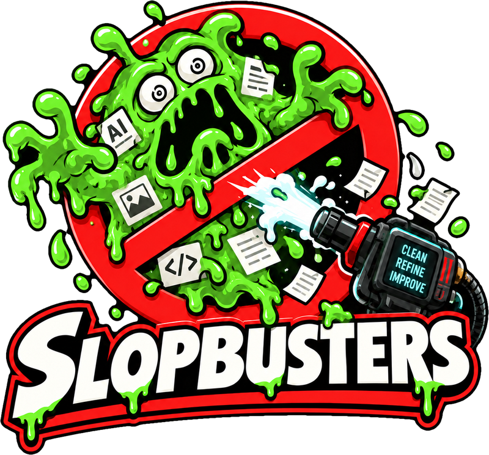

<p align="center">
  
</p>

<p align="center"><em>Who you gonna prompt?</em></p>

Agent skills and a local review workspace that keep AI slop out of your plans, designs, and code. The review app brings grouped diffs, inline feedback, and GitHub discussions into one UI. Skills follow the open [Agent Skills](https://agentskills.io/specification) format, so the same skills work in Claude Code, Codex, Cursor, Gemini CLI, opencode, and any other compatible agent.

## Review app

Requires Node 24 or a newer supported version, pnpm 9.15.5, and [GitHub CLI](https://cli.github.com/).

```sh
pnpm install --frozen-lockfile
gh auth login
pnpm desktop:dev
```

The Electron app opens a local review workspace. Select a repository or paste a PR URL. Read changes in file order, or organize related code with your installed Codex or Claude Code CLI. Draft comments stay local until you explicitly submit a GitHub review; you can also copy feedback into your coding agent. Sign in to your chosen coding CLI before organizing changes.

Viewed sections, drafts, PR snapshots, and preferences persist in SQLite. Unchanged sections keep their viewed status when a PR updates, and “Unviewed only” hides completed sections. Background checks highlight “Updates available” on Reload when the PR changes. Exact moved or copied code has source → destination markers in the review UI. Open **Settings** from the homepage to choose among 24 themes, including Nord, Tokyo Night, Catppuccin, Solarized, and One Dark.

Stack badges appear in the inbox and review header. Open one to navigate the PR chain, see its statuses, and locate the current PR. GitHub native stacks take precedence, with a labeled branch dependency fallback for older stacks. Draft PRs use gray icons in the inbox.

CI indicators and merge readiness show which PRs need attention. Open their details to inspect checks, required approvals, code owner requirements, and each reviewer's decision. Every layer in a stack shows its own blockers and status, which refresh while the panel is open.

`pnpm build` builds the desktop app; `pnpm desktop:start` opens it and `pnpm desktop:pack` creates a local application bundle. `pnpm dev` still runs the browser UI at http://localhost:4310; `pnpm start` serves its last build at http://localhost:4311. See the [desktop guide](apps/desktop/README.md) and [reviewer guide](apps/reviewer/README.md) for details. The UI currently reviews GitHub pull requests; the skills below also cover issues, plans, specs, and PR preparation.

The diff viewer and UI components include MIT-licensed code from [T3 Code](https://github.com/pingdotgg/t3code). Its copyright and license notices are preserved in source and builds. See [third-party notices](THIRD_PARTY_NOTICES.md) and the [port and publication review](docs/reviewer-port.md) for source provenance and license scope.

## Install

**Claude Code**

```
/plugin marketplace add fernandobandeira/slopbusters
/plugin install slopbusters@slopbusters
```

**Codex**

```
codex plugin marketplace add fernandobandeira/slopbusters
codex plugin add slopbusters@slopbusters
```

**Gemini CLI**

```
gemini extensions install https://github.com/fernandobandeira/slopbusters
```

**Cursor, opencode, Copilot, and everything else**

```
npx skills add fernandobandeira/slopbusters
```

or, with the GitHub CLI:

```
gh skill install fernandobandeira/slopbusters
```

Both detect which agents you have installed and copy the skills into the right place.

## Skills

| Skill | What it does |
|-------|--------------|
| [`joel`](skills/joel/SKILL.md) | Issues, bug reports, PRDs, and parent issues in the voice of Joel Spolsky. Opens with the job the reader is hiring the change for, writes a first screen a human can decide from in a minute, and puts everything an implementer or agent needs behind collapsed sections labeled with the questions they answer. Gathers requirements the Mom Test way and shapes the document like a press release and FAQ. |
| [`unclebob`](skills/unclebob/SKILL.md) | Clean-code review in the voice of Uncle Bob. Reviews a branch, uncommitted changes, or a PR for readability, reusability, low cognitive load, and layered "stepdown" structure where high-level functions state the business rule. Also checks Arrange-Act-Assert tests. |
| [`linus`](skills/linus/SKILL.md) | Pull requests the way kernel maintainers expect patch series, in the voice of Linus Torvalds. Decides between one PR and a stack, splits oversized PRs into layers that each make one logical change and build on their own, and writes titles, descriptions, and commit messages a reviewer can act on. |

## Repo layout

```
skills/<name>/SKILL.md        # every skill lives here; all agents share it
apps/reviewer/               # local React + Express review app
apps/desktop/                # Electron runtime and packaging
docs/reviewer-port.md         # port provenance and public-source review
.claude-plugin/               # Claude Code plugin + marketplace
.codex-plugin/                # Codex plugin
.agents/plugins/              # Codex marketplace
.cursor-plugin/               # Cursor plugin
gemini-extension.json         # Gemini CLI extension
archive/                      # the original opencode agents and templates, kept for reference
```

Run `pnpm lint`, `pnpm test`, and `pnpm build` from the root to check the review app. `pnpm desktop:smoke` verifies the native app, SQLite persistence, and saving before quit.

## Writing a skill

1. Create `skills/<name>/SKILL.md`. The `name` must match the folder: lowercase letters, numbers, and hyphens only.
2. Add frontmatter with `name` and `description`. Agents read the description to decide when to use the skill, so say what it does *and* when to use it.
3. Describe actions, not tool names ("search the codebase", not "use the Grep tool"), so the skill works in every agent.
4. Put supporting files (scripts, references, examples) next to `SKILL.md`.
5. Push to `main`. Codex, Cursor, and Gemini cache plugins by version, so the [bump-version](.github/workflows/bump-version.yml) workflow bumps the patch version in `.codex-plugin/plugin.json`, `.cursor-plugin/plugin.json`, and `gemini-extension.json` whenever `skills/` changes. Bump the minor or major version by hand in the same push when it calls for one, and the workflow leaves it alone. Pull afterwards, since the bump lands as its own commit.

```markdown
---
name: example-skill
description: What this skill does. Use when the user asks for X or mentions Y.
---

# Example Skill

Instructions for the agent...
```

Built with code from [T3 Code](https://github.com/pingdotgg/t3code).
