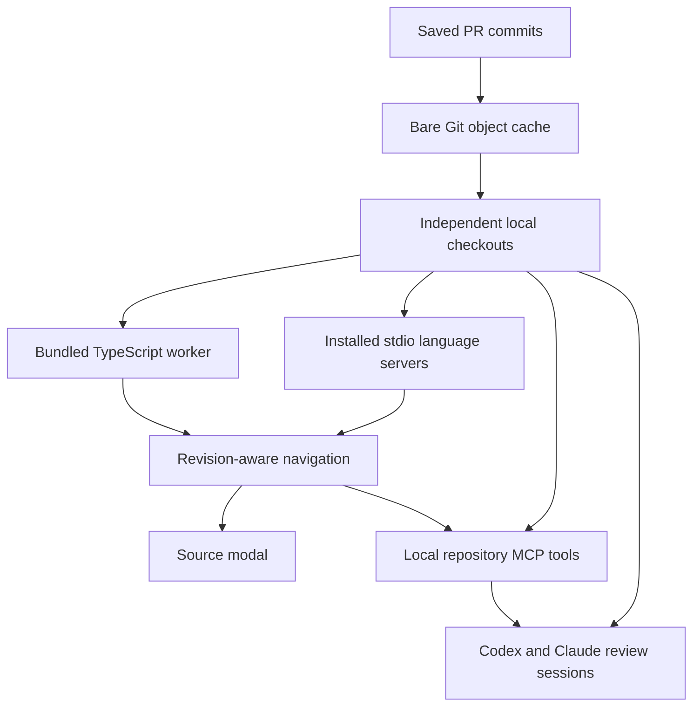

# Local repository context for PR review

Slopbusters prepares independent local Git checkouts at the saved PR head or diff merge-base commit. Source navigation and repository-aware Codex/Claude sessions use these copies to inspect code outside the diff. The app never switches branches or modifies an existing user clone.

## Checkout choice

Each `(owner, repository, commit)` has its own shallow, detached checkout under the app's data directory:

```text
review-workspaces/<owner>/<repository>/<commit>/
```

The existing bare source cache supplies Git objects. Fetching those objects into a new repository copies them without shared object alternates, hardlinks, or worktree metadata. The checkout can therefore survive cache removal and remains reusable offline after restart. Different PR revisions and the old/new diff sides use separate directories. Reopening a PR never substitutes a newer branch for its saved commit.

This trades some disk space for independence. Worktrees would couple checkout lifecycle to a shared Git directory; creating them from a user's repository would also mutate its metadata. A user-folder picker and environment reuse are deferred. This implementation works without knowing a repository's language, test command, services, or environment files.

## Shared services



`ReviewWorkspaces` coalesces concurrent preparation, validates exact HEAD and cleanliness, creates checkouts atomically, and tracks active leases. Settings lists completed copies and can remove unused ones. Cleanup refuses a copy with unexpected edits, untracked files, or an active review. It never resets or cleans a changed directory. Interrupted preparation is removed on ordinary failure; an abrupt process termination may leave an unused `.preparing-*` directory.

TypeScript/JavaScript analysis runs in a persistent worker outside Electron's main thread. It reads the full project configuration, nested tsconfig/jsconfig files, project references, committed workspace package sources, and bundled standard libraries. Configured language plugins are disabled. Other languages use the existing configurable installed stdio servers with the full checkout and project configuration available. Sessions are keyed by repository, revision, and language/project; idle sessions can be retired without removing the checkout.

GitHub API source loading and the older bounded snapshot analyzer remain explicit fallbacks if a local revision cannot be prepared. Context expansion prefers local immutable blobs. Returned semantic locations identify the saved SHA and whether analysis used a checkout or snapshot. Only committed regular source files can be opened as review evidence.

## Agent inspection

Linus's existing PR wording and review-boundary audit prepares repository context before starting its two independent reviewers. Both reviewers and reconciliation receive the same saved head checkout and a short-lived authenticated loopback MCP endpoint. Lightweight diff grouping still uses supplied text in a temporary directory.

The endpoint offers `list_files`, `read_file`, `search_text`, `go_to_definition`, `find_references`, and `find_implementations`. Semantic queries use the UI's navigator and can select head or merge-base source. File reads use immutable Git blobs; search scans tracked checkout files and reports its bounds. Native provider reads/searches are also available in the checkout. Codex runs with a read-only sandbox; Claude exposes Read/Glob/Grep and these MCP tools without shell or edit tools. Cancellation terminates provider process groups and releases the context when model work finishes.

This does not turn the wording audit into a general code-review agent or execute tests. CI continues to own lint/test checks and merge gates. No dependencies, environment files, services, build steps, or setup scripts are provisioned automatically.

## Navigation behavior

A single semantic definition opens and highlights its destination. The source modal retains Back/Forward history. Repeating a jump at the current declaration reports “Already at this definition” without reloading its file. An unresolved symbol reports the missing result while preserving the current source. Configuration and missing-import diagnostics remain visible rather than being hidden. Multiple locations retain the existing chooser.

The reported `FboAccountPurpose` project was not used as a fixture. Synthetic regressions cover aliases and enum declarations, same-location handling, unresolved results, large projects, workspace package exports, nested configuration, both revisions, and installed-server transport. They verify the architecture and failure behavior without assuming this particular repository's setup.

## Limits and verification

Local source does not guarantee complete semantic resolution. Missing dependencies, generated output, package-based inherited configuration, Git LFS contents, and submodules can still prevent a jump. No submodules, LFS objects, or checkout filters are downloaded or run. Source inspection opens text files up to 512 KiB; analysis reads source files up to 2 MiB; navigation returns up to 500 locations. MCP searches cap matches, bytes, and time and report truncation. Installed language servers may invoke their own project tools; configuring one requires an existing local toolchain.

Tests exercise real temporary Git repositories, clean/dirty restart behavior, unchanged user branches, independent object storage, offline reuse, application APIs, worker navigation, stdio LSP requests, authenticated MCP tools, provider arguments, and reviewer-context lifecycle. The Electron smoke test exercises the shipped worker and standard libraries separately from renderer fixtures, and verifies source history and resolution notices in the actual sandboxed renderer. Provider integration tests do not make paid model calls.
